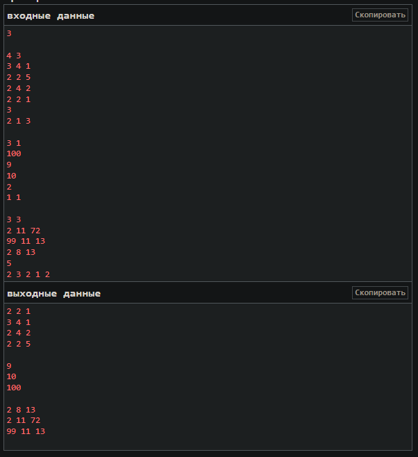

# Сортировщик матриц

Вам необходимо написать часть функциональности обработки сортировок в электронных таблицах.

Задана прямоугольная таблица n×m (n строк по m столбцов) из целых чисел.

Если кликнуть по заголовку i-го столбца, то строки таблицы пересортируются таким образом, что в этом столбце значения будут идти по неубыванию (то есть возрастанию или равенству). При этом, если у двух строк одинаковое значение в этом столбце, то относительный порядок строк не изменится.

## Рассмотрим пример.

В этом примере сначала клик был совершен по второму столбцу, затем по первому и, наконец, по третьему.

Заметим, что если кликнуть подряд два раза в один столбец, то после второго клика таблица не изменится (в момент второго клика она уже отсортирована по этому столбцу).

Обработайте последовательность кликов и выведите состояние таблицы после всех кликов.

Неполные решения этой задачи (например, недостаточно эффективные) могут быть оценены частичным баллом.

## Входные данные
В первой строке записано целое число t (1≤t≤100) — количество наборов входных данных в файле. Далее следуют описания наборов, перед каждым из них записана пустая строка.

В первой строке набора записаны два целых числа n и m (1≤n,m≤30) — количество строк и столбцов в таблице.

Далее следуют n строк по m целых чисел в каждой — начальное состояние таблицы. Все элементы таблицы от 1 до 100.

Затем входные данные содержат строку с один целым числом k (1≤k≤30) — количество кликов.

Следующая строка содержит k целых чисел c1,c2,…,ck (1≤ci≤m) — номера столбцов, по которым были осуществлены клики. Клики даны в порядке их совершения.

## Выходные данные
Для каждого набора входных данных выведите n строк по m чисел в каждой — итоговое состояние таблицы. После каждого набора выходных данных выводите дополнительный перевод строки.

## Пример
